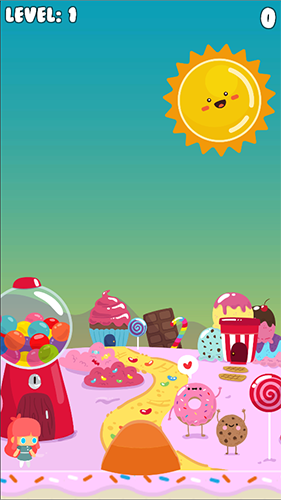
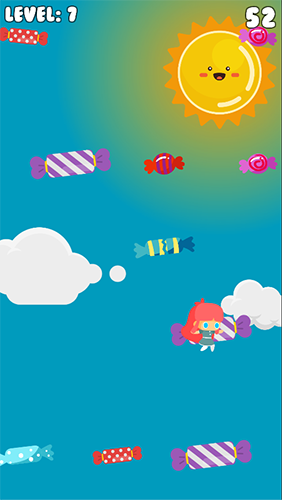

# Candy Jump
Simple 2D platforming game with infinity gameplay. Is controlled by smartphone accelerometer.

#### Level generator algrithm:

[GridGenerator.cs](https://github.com/Skaper/CandyJump/blob/master/CandyJump/Assets/Scripts/GridGenerator.cs)

The script splits the screen on 12x6 grid, based on player's position and generates random 2D array map of level. After that the script calculate  central positions of cells and put prefabs there.

#### Google Play link: https://play.google.com/store/apps/details?id=com.skaper.candyjump
